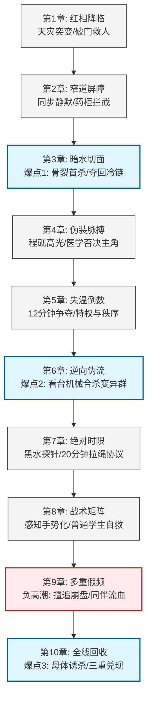

# 《赤潮北岸》第一卷第一阶段高燃重构方案（前10章）

## 资产管理与 Auctra CLI 结构化规范

```yaml
auctra_asset:
  phase: outline / scene_cards
  artifact: chapter_outline / scene_cards
  gate: chapter_write
  locale: zh-CN
  layout: chinese-novel
  display_path: 大纲/第一卷第一阶段高燃重构方案.md
  project_title: 赤潮北岸
  author_facing: true
  risk_flags:
    pacing_risk: resolved (已重构十章波形，确保每章有独立冲突与递进爽点)
    power_creep_risk: resolved (严格锁定感知级雏形，避免出现城市级巨兽或无代价吞核)
    character_agency_risk: resolved (保障沈照雪、程砚、罗启明与普通学生的不可替代战术贡献)
  handoff:
    target_skill: chinese-novel-chapter-writer
    prerequisite_gate: auctra gate check --before chapter_write --json
```

---

## 一、 阶段总体架构与爽点引擎

### 1. 阶段定位与核心承诺
* **核心弧线**：**首杀与共鸣——从“只会单独硬冲的独狼”到“愿意信任同伴与倒计时的可靠队员”**。
* **剧情范围**：第 1 章至第 10 章（校园封闭空间生存、变异生态初现、小队雏形建立、校园母体诱猎）。
* **空间压迫**：江湾高中实验楼 → 体育馆储物间窄道 → 地下设备层黑水管道 → 临时医疗急救点 → 封闭储药仓 → 伸缩看台与安全连廊 → 地下主排水泵房。
* **三大门禁底线**：
  1. **严禁力量通胀**：前 10 章决不出现成熟期城市级巨兽，决不提前解锁系统自动发奖励或无代价吸收潮核；主角的能力是**感知与局部定向适应**，代价为偏头痛、幻听与赤化侵蚀。
  2. **严禁降智群像**：沈照雪（战术与倒计时协议）、程砚（医学否决与分诊秩序）、罗启明（学生大队动员与重力门阀控制）、许闻澈与陶俊（普通学子在阶层危机下的担当），每个人都必须拥有主角无法替代的专业功能。
  3. **严禁流水账与纯过渡**：每章必须在“敌情、能力认知、物资资源、伤病负担、组织关系、战术目标”中至少改变两项，实现“小章有反转，三章一爆点，十章总兑现”。

### 2. 阶段十章波形图（节奏与回报分解）



### 3. 三重兑现台账（第 1—10 章总结）

| 兑现维度 | 具体成果与状态改变 | 读者爽点与情感共鸣 |
| :--- | :--- | :--- |
| **个人能力 (Protagonist)** | 获得水流、低频振动与生物节律感知雛形；完成首杀并与“水栖适应核”初步共鸣；右臂灼纹延伸，负担幻听与偏头痛代价。 | 告别盲打，在黑暗和水下拥有“上帝视角”；战斗极具策略性与张力。 |
| **队伍/装备 (Team & Gear)** | 形成以叶知衡（尖刀感知）、沈照雪（战术决策/路线）、程砚（医学分诊/污染否决）、罗启明（组织执行）为核心的校园小队；获得第一批“高阶鳃过滤膜”。 | 群像非挂件；明确“没有谁能单打独斗活在末世”，战友间的背靠背生死誓约。 |
| **城市/物资 (City & Tech)** | 彻底清除校园浊水母体；排空校园内涝，打通通往东侧排水网的安全连廊；首批鳃过滤膜成为北岸第一代防毒面罩的核心试制材料。 | 杀怪掉落不充值数值，而是直接转化为改变生存环境与防护工程的实在产物。 |

---

## 二、 逐章设计大纲与详细场景卡

---

### 第 1 章：红相降临（沉降纪元第一夜）
* **定位**：开篇炸裂入场，拒绝世界观说教，用极端天灾与生死决策立住主角性格与身体异样。
* **入场状态**：2080 年夏末，江湾高中实验楼，暴雨变色，通信中断，校园水位半小时暴涨一米。
* **核心目标**：带领滞留低层教室的特招生与学生撤往地势最高的体育馆，并抢救被困学生。

#### 详细场景卡 (Scene Cards)
* **场景 1-1（红雨与血色下水道）**
  * *行动与冲突*：红雨倾盆，校园地面下水道倒灌，冒出腥臭的暗红色泡沫。学校广播发出电音乱码，要求全员原地静候。叶知衡发现排水管传出的震动并非水流，而是密集的硬物刮擦管壁声。
  * *对白与潜台词*：教务人员要求遵循守则等待救援；叶知衡简短反驳：“等水淹过台阶，门就会被水压顶死。要走的现在跟我走。”（展现不信教条、只信生存直觉的独狼性格）。
  * *转折与后果*：部分特招生随他冲出，低楼层迅速被浑浊污水淹没。
* **场景 1-2（破门救人与灼纹苏醒）**
  * *行动与冲突*：通向体育馆的安全侧门因漏电与身份识别闸机故障锁死。门内低层传来许闻澈的敲门与求救声，水位已淹到他脖子。
  * *对白与潜台词*：学生争论要不要等运维老师报修，叶知衡不答话，抄起消防液压棍插进合金门缝。
  * *转折与后果*：他以超越常人的爆发力强行撬开侧门，把溺水的许闻澈拖出。在强行发力的一瞬，他右臂皮肤下旧日留下的暗红灼纹如烧红的铁丝般骤然发热亮起！
* **场景 1-3（体育馆封门与危机悬念）**
  * *行动与冲突*：众人冲入体育馆并锁死大门。沈照雪在清点人数时，敏锐注意到叶知衡捂着右臂冷汗直流，且右臂袖口下隐现红光。
  * *对白与潜台词*：沈照雪问：“你的手怎么回事？你碰过外面的水？”叶知衡压住手腕：“拉门扭了。先清点急救包。”
* **章尾钩子 (Hook)**：
  体育馆设备间临时急救站传来罗启明的怒吼：“急救药箱里的冷藏抗菌药对不上号！少了一整袋！”与此同时，体育馆下方的地砖缝隙里，传出一声凄厉的、绝对不属于人类的咀嚼与惨叫。

---

### 第 2 章：同步静默与窄道屏障
* **定位**：建立人类内部资源争执与外部变异生物入侵的双重高压，首次展现“变异生态协同性”与主角的战术预判。
* **入场状态**：体育馆内 200 名师生被困，外伤与溺水者急需抗感染药物，物资短缺引发阶层猜疑。
* **核心目标**：从争吵中夺回防线控制权，抵御下水道首波变异鼠群的渗透突击。

#### 详细场景卡 (Scene Cards)
* **场景 2-1（资源的猜疑与同步静默）**
  * *行动与冲突*：特招生与高价择校生因药箱失窃互相指责。叶知衡靠靠在墙边，右臂灼纹跳动，他耳朵里忽然捕捉到奇怪的变化——地下管道里原本嘈杂千万只老鼠的抓挠声，在同一秒钟**同时停止了**。
  * *对白与潜台词*：众人在吵“是谁偷了特种药”，叶知衡猛然抬头暴喝：“都闭嘴！不想死就往高处推滑门！”（用生存危险强行碾压无意义的内耗）。
  * *转折与后果*：生物捕食前的“同步静默”现身，所有人被他气场镇住，争吵中断。
* **场景 2-2（球车窄道与第一道防线）**
  * *行动与冲突*：储物间排水栅栏被顶飞，数十只眼睛血红、体型暴涨一倍的变异鼠如潮水般涌出！宽敞的球场不利于防守，叶知衡带头掀翻器材球车，把入口压缩成一人宽的狭窄屏障。
  * *对白与潜台词*：罗启明（体育生大队长）咬牙撑住球车：“这些耗子疯了？力气这么大！”叶知衡反手拔出工兵铲：“它们骨头变硬了，别打肚子，砸脖颈节点！”
  * *转折与后果*：沈照雪迅速组织学生拆下跳高海绵垫做缓冲后盾，前排顺利抗住第一波冲击。
* **场景 2-3（鼠王绕后与冷链劫夺）**
  * *行动与冲突*：变异群中一头体型如猎犬、前爪角质化的“鼠首领”并未正面冲锋，而是从货架下方积水区悄无声息绕后，一口咬住了堆在墙角的临时冷藏药箱内袋！
  * *对白与潜台词*：陶俊为护药扑上去，小腿被鼠首领角质化前爪狠戾切开一条深槽，惨叫倒地。
  * *转折与后果*：鼠首领叼走唯一一袋救命的特种抗菌药，顺着设备层的黑水管道通道钻入地下黑洞。
* **章尾钩子 (Hook)**：
  防线暂时稳住，但命脉被夺。罗启明喘着粗气第一次主动向叶知衡询情：“知衡……下一波，它们会从哪来？”叶知衡盯着设备层漆黑的洞口，右臂发烫，他听到地下十米深处，正传来一阵沉重、缓慢、根本不像鼠类能发出的巨大心脏搏动声。

---

### 第 3 章：暗水切面与首杀共鸣（爆点一）
* **定位**：第一阶段首个大爽点！主角单人极限追击，展现“感知反杀与环境借力”，斩获全书首杀。
* **入场状态**：冷藏药袋脱离冷链后，最大存活有效倒计时仅剩 15 分钟；陶俊伤口感染急速恶化。
* **核心目标**：单人进入黑暗的地下设备层，斩杀鼠首领，夺回冷藏药袋。

#### 详细场景卡 (Scene Cards)
* **场景 3-1（伪波纹误导与黑暗孤猎）**
  * *行动与冲突*：叶知衡顺着水迹与滴水回声滑入地下设备间。黑暗中，鼠首领极其狡诈，利用管道残水滴落和尾巴拍水，在叶知衡的震动感知里制造出三个不同方向的“伪移动波纹”。
  * *对白与潜台词*：叶知衡在黑暗中屏住呼吸，潜台词：“它在测我的反应……这畜生懂得利用水声做诱饵。”
  * *转折与后果*：叶知衡胳膊被黑暗中的利爪划开一道口子，他意识到在水声密闭空间，单纯依赖听觉会被“声学陷阱”反杀。
* **场景 3-2（环境反杀：门框折骨杀！）**
  * *行动与冲突*：叶知衡迅速改变策略！他不再听声音，而是闭上眼，通过地砖积水的细微反射光变化与管道连通坡度，在心中构筑出地下暗水的立体几何图形。他将自己滴血的手腕垂在水面上作为诱饵！
  * *对白与潜台词*：鼠首领抵挡不住高代谢对血肉的饥渴，凌空暴起扑咬！叶知衡冷喝一声：“抓到你的弧线了。”
  * *转折与后果*：在异兽落下的刹那，叶知衡不与它硬拼力量，抓起包着的隔热毯带着它向后顺势翻滚，精准将鼠首领的粗壮颈项卡入液压防火重门的门框狭缝！他飞起一脚踹落手闸，几百斤的重型机械门借回弹力轰然砸下，咔嚓一声，干净利落夹断异兽颈骨！**（全书首杀兑现！）**
* **场景 3-3（团队代价：暴露协同缺陷）**
  * *行动与冲突*：叶知衡提着滴血的鼠尸和药袋爬回体育馆，却见体育馆门前一片狼藉——因为他下去前只留下一句“等我”，没有报路线和联络信号，罗启明为救他带着大队盲目跟进，在楼梯间遭遇残余鼠群袭击，多名学生受伤，陶俊的腿伤进一步加重。
  * *对白与潜台词*：罗启明愤怒：“叶知衡！你很能打是不是？但如果你下去前告诉我们管道有分叉，陶俊根本不用多吃这一抓！”
  * *转折与后果*：叶知衡抓紧药袋，无言以对。他的个人英雄主义在换来胜果的同时，第一次显露出致命的集体战术缺陷。
* **章尾钩子 (Hook)**：
  程砚接过药袋救治伤员。沈照雪用手电筒照向那头被打死拖回的变异鼠首领——只见这异兽的腹腔被解剖开后，里面毫无常规的心肝脾肺肾，只有一团如红色珊瑚般、在断电水流中依然微微收缩搏动的**凝胶状适应囊**！

---

### 第 4 章：伪装脉搏与医学否决
* **定位**：打破“男主武力至上”的单向思维，引入见习医学生程砚的专业高光，确立人类秩序与科学分诊在末世的权威。
* **入场状态**：伤员剧增，异兽标本带来的污染威胁开始在密闭体育馆发酵；众人对超自然变异极度恐慌。
* **核心目标**：阻止神秘感染在学生间扩散，解开“假脉搏”谜团，建立初步医疗检疫规则。

#### 详细场景卡 (Scene Cards)
* **场景 4-1（假脉搏与幻听被戳穿）**
  * *行动与冲突*：临时医疗台上，程砚在给异兽残骸和接触过血水的伤员做触诊。当心电电极贴上那团红色凝胶囊时，监护仪上竟跳出了与人类心跳模一样的“正常窦性心律”！人群大乱，以为这是活体寄生。
  * *对白与潜台词*：众人尖叫：“怪物活着！它钻进陶俊伤口里了！”叶知衡靠感知先一步听出频率不对，厉声驳斥：“不是心跳！是它在模仿仪器的电流振动！”
  * *转折与后果*：叶知衡为了解释，不得不当众说出自己耳朵里能听见“水和肌肉在高频说话”的秘密。
* **场景 4-2（程砚高光：科学否决玄学）**
  * *行动与冲突*：见习医学生程砚毫无惧色，戴上手套，用解剖刀稳准狠地将残骸表面的导电红膜剥离。他用严谨的神经传导速率和红膜渗透率验证，证明这是一种“电导拟态反馈”。
  * *对白与潜台词*：程砚推了推眼镜，用冷酷的专业口吻说：“怪物不明白什么是心跳，它只是在试图与所有通电的金属和生物组织同步。叶知衡，你的直觉很准，但在我的医疗区，你得听医学指标。”
  * *转折与后果*：程砚借由叶知衡的震动定位，一举找出陶俊伤口深处隐匿的潜伏寄生微膜，用高浓度碘伏电灼强行清除，救回伤员。
* **场景 4-3（监护清单与限制自由）**
  * *行动与冲突*：程砚给叶知衡做了瞳孔与体温快检，发现他在首杀共鸣后体温高达 39.5 度且伴有微弱赤化脉冲。程砚以“污染过载高危对象”为由，当众剥夺主角的自由出入权。
  * *对白与潜台词*：程砚：“从现在起，你必须在两名无症状学生监护下活动。你的身体是把武器，但枪管已经烧红了，我不允许一颗定时炸弹在人堆里乱逛。”
  * *转折与后果*：沈照雪在诊断书上签字，主动担任主角的第一监护人与战术规划者。
* **章尾钩子 (Hook)**：
  角落里，此前被叶知衡破门救出的许闻澈蜷缩在毛毯下。当大家以为他安然无恙时，他脖颈伤口下，悄然增生出一条细如发丝的红线，那条红线跳动的频率，竟与刚才监护仪上的假脉搏**一模一样**！

---

### 第 5 章：失温倒计时（物资秩序的重新切分）
* **定位**：推进到限时生存博弈，探讨灾变下旧阶层特权的消解与新公共秩序的建立；许闻澈完成从受助者到物资贡献者的转变。
* **入场状态**：体育馆主电源跳闸，地下备用蓄电池因倒灌水侵蚀，报警提示有效供电倒计时仅剩 12 分钟。
* **核心目标**：在 12 分钟断电彻底失温前，打开电子锁死的特种医疗冷藏仓，抢出最后的外伤药与试剂。

#### 详细场景卡 (Scene Cards)
* **场景 5-1（12 分钟极限与恐慌要求）**
  * *行动与冲突*：冷柜红灯狂闪，12 分钟后恒温室将彻底报废，所有特种蛋白酶与疫苗将变性失效。部分择校生害怕被许闻澈身上的“红线症状”传染，要求把许闻澈与叶知衡一起驱赶出核心保护区。
  * *对白与潜台词*：择校生代表叫嚣：“我们缴了高昂的赞助费，这储药室是我爸公司捐的！先救我们！”叶知衡捏紧拳头要动手，被沈照雪拉住。
* **场景 5-2（许闻澈身份开仓与主角画线）**
  * *行动与冲突*：许闻澈从毛毯下站起，没有退缩！他利用家族为赞助商留下的维护超级密码和机械手动泵位置，协助大队破开冷藏室主安全锁；与此同时，叶知衡趴在积水中，将感知张开到最大，指着地下三处正剧烈冒泡的排水地漏。
  * *对白与潜台词*：许闻澈输入密码：“我爸捐药是为了救人，不是为了给你们当特权陪葬品！”叶知衡以斩钉截铁的口吻命令搬运队：“踩我画白线的地方走！地漏下两米有三头成只异兽在等震动，谁踩错步子，神仙难救！”
  * *转折与后果*：学生搬运队踩着主角标出的“绝对安全线”，在倒计时最后 40 秒，将上百盒抗感染药和营养液安全抢运上二楼看台。
* **场景 5-3（三类物资法与秩序确立）**
  * *行动与冲突*：物资搬出，程砚和罗启明当众立下新纪元的第一条公约：所有药品无论原有所有权，一律按“可用、待检、废弃”三类公开建档，按伤情分配。
  * *对白与潜台词*：程砚当众宣布：“在这里，没有富少，没有特招生。能打赢的在前排，有知识的救人，什么都不懂的干体力。违者断药。”
* **章尾钩子 (Hook)**：
  蓄电池彻底熄火，校园陷入漆黑，只有应急绿灯幽幽闪烁。叶知衡突然按住太阳穴，一阵剧烈的幻听撕扯着他——他感知到地下四面八方几百条管道里的异兽抓挠声，在这一分钟全部掉头，朝着同一个目标开始集体行军——**校园主排水泵房**！

---

### 第 6 章：伸缩看台的逆向围猎（爆点二）
* **定位**：第二大爽点！团队告别被动防守，普通学生群体发力，利用现代建筑机械构件完成对变异群的“工业化绞杀”。
* **入场状态**：往实验楼和主道路的安全连廊被大量变异鼠与红质菌膜完全封死，两百师生彻底沦为困兽。
* **核心目标**：清洗连廊，主动消灭围堵的变异群，夺回连廊主通道控制权。

#### 详细场景卡 (Scene Cards)
* **场景 6-1（被动困兽到主动布局）**
  * *行动与冲突*：看着密密麻麻堵在连廊玻璃外的变异兽群，众人生出绝望。叶知衡反而拔出了工兵铲：“它们过来是为了觅食，如果我们把最好的饵下在最硬的夹子里呢？”
  * *对白与潜台词*：沈照雪立刻领会其意：“体育馆的电动伸缩看台！自重四百吨，底座全是齿轮和合金支架！”罗启明大喝：“男生大队，全都给老子去摇手动绞盘！”
  * *转折与后果*：团队迅速形成极具分工的战术部署：普通学生拆卸跳高海绵垫和防火布铺设导向盲道，罗启明分配看台六个摇柄的绞杀小组。
* **场景 6-2（诱敌深入与机械碾压合杀！）**
  * *行动与冲突*：叶知衡与沈照雪配合，打开消防栓排洪阀，制造出人工水流和带有新鲜血气冲刷的诱饵路线。数十只变异鼠争先恐后顺水冲入体育馆底层的伸缩看台轨道下方！
  * *对白与潜台词*：看着怪物进入底部，叶知衡被好只跳上操作台的鼠兽撕咬，但他死死把住操作门，放声厉吼：“倒数 3、2、1……就是现在！落闸！转绞盘！”
  * *转折与后果*：**轰隆！** 四百吨合金伸缩看台在数十名普通热血少年的齐心拉动下，如史前巨兽的钢牙般轰然合拢！令人头皮发麻的金属咬合声与碎骨声伴随爆发，轨道下方的变异鼠群被机械伟力彻底碾成肉泥！**（普通学生战术高光兑现！）**
* **场景 6-3（首获过滤膜与成果分享）**
  * *行动与冲突*：连廊通道彻底出清！在清理机械齿轮残骸时，叶知衡从一头较大型异兽的心肺部位，剥离出一片坚韧、布满微细孔洞的半透明膜状组织。
  * *对白与潜台词*：程砚接手测试，眼中大放异彩：“这层膜对赤潮有毒水汽的吸附与阻隔效率是工业碳的五倍！叶知衡，你发现了个大宝贝！”
  * *转折与后果*：叶知衡没有私藏，主动将过滤膜交给程砚团队试制第一代简易防毒面罩。他第一次感受到与团队配合带来的、远胜单打独斗的巨大成就感。
* **章尾钩子 (Hook)**：
  看台操作台上的监控终端闪过一道电光，画面切到了地下泵房实时监控：只见地下主泵机已经被黑红色的浑水淹没了三分之二，而在激流旋涡的中央，一只无与伦比的、覆布条状红膜的“巨型水生伪臂”，正缓慢地把一根粗如水桶的主排水管道**直接捏扁**！

---

### 第 7 章：绝对时限（黑水探针与拉绳协议）
* **定位**：高压下的深水救援，建立男女主“生死相托、严守倒计时”的战术契约，考验主角规则意识。
* **入场状态**：主排水泵房如果继续被坏，两小时后全校地基将彻底泡水垮塌；地下泵房高台上有幸存运维师发出求救敲击。
* **核心目标**：潜入已经被黑水淹没的泵房水道，在主泵自动强冲洗启动前（20分钟窗口期）把活人救出。

#### 详细场景卡 (Scene Cards)
* **场景 7-1（20 分钟死亡红线与拉绳协议）**
  * *行动与冲突*：地下机房水冷刺骨，由于自动程控不可逆，20 分钟后将启动万吨级高速排水涡轮，水下一切都会被绞碎。叶知衡执意下水，沈照雪没有阻拦，而是用高强度工程攀岩绳在两人腰间打下了绝密结扣。
  * *对白与潜台词*：沈照雪眼神严厉而专注：“一次拉绳报告位置，两次拉绳准备返回，三次连拉——无论你在下面看到什么，我必须强行绞盘把你拉上岸！叶知衡，把你的生命线交给我，能做到吗？”叶知衡凝视她：“做到。”
* **场景 7-2（黑水救援与倒计时折返）**
  * *行动与冲突*：水下乌黑一片，水泵噪音巨大，叶知衡的感知一度被干扰；但他静下心，通过腰间绳索上传来的沈照雪心跳脉冲与倒计时拉动节奏，反向锚定了方位！
  * *对白与潜台词*：第 17 分钟，他在水下摸到了紧抱在冷凝管上的幸存高三运维生。运维生死死抱着铁管不撒手，叶知衡在水中比出沈照雪教的手势：“相信绳子，放手！”
  * *转折与后果*：在倒计时第 19 分钟 50 秒，巨型涡轮启动前十秒！沈照雪和罗启明在岸上全力转动绞盘，将两人顺水直飞拉出水面！叶知衡没有贪心多探，完美履行了“按时折返”的诺言。
* **场景 7-3（交托决策与水下恶音）**
  * *行动与冲突*：获救的运维生喘息着交出一张他用防水笔画在工牌背面的《机房底层暗渠管线手绘图》。
  * *对白与潜台词*：沈照雪将擦手的毛巾丢给叶知衡：“下一段路线怎么走，指挥权交给你。”（男女主战术指挥权首次顺利完成让渡）。
* **章尾钩子 (Hook)**：
  大家正在庆幸幸存者获救，程砚将水下音频探针接入机房广播。突然，扬声器里传出清晰的“咚、咚、咚……救命……救……我”的声音——但在刚才救人时，机房底层**根本已经没有第二个人了**！那声音，是某头成熟的异兽，正在用发声器官精确模仿活人的呼救，诱骗人类再次下水！

---

### 第 8 章：感知手势化（战术信号矩阵）
* **定位**：主角个人特异功能向团队基础建制转换的关键转折点！将感知转化为可视化操作语言。
* **入场状态**：拟声母体在地下水渠与墙体夹层中高速游走，随时可能破墙冲入人群密集区；常规通讯与语言指挥太慢且容易暴露。
* **核心目标**：创造一套静音、精确、人人可执行的即时情报信号，动员全员参与阻击。

#### 详细场景卡 (Scene Cards)
* **场景 8-1（感知难题与手势矩阵诞生）**
  * *行动与冲突*：叶知衡能听见怪物在右边墙后 5 米，但喊出“右边第二堵墙后水管旁边”时，怪物早已游走 10 米！
  * *对白与潜台词*：沈照雪找来白板纸：“把你的感应拆成四句话！水流变化——单手划波；活体接近——握拳竖指；撞击倒数——三指压下；未知名危险——双手交叉。用手势！”
  * *转折与后果*：短短十分钟，四套基础《赤潮战术手势》在体育馆 200 名学生中接力熟记。叶知衡的耳朵，变成了整个求生大队神经系统的中央探测雷达！
* **场景 8-2（全员闭闸自救高光）**
  * *行动与冲突*：机房通道侧墙突然炸裂！一条长满倒刺的母体前锋触手如毒蛇般射向学生大队后方！
  * *对白与潜台词*：站在高处的叶知衡无声对沈照雪打出“撞击倒数—正前方—三指”手势！沈照雪同步向下方学生挥舞手令！
  * *转折与后果*：下方负责控制重型防水闸门的四名普通学生没有任何迟疑，在黑暗中凭借对手势的绝对信任，齐心飞扑按下液压闸门释放钮！**轰！** 沉重的合金闸门应声落下，将母体触手狠狠切断在铁门之外，成功保护了队伍！
* **场景 8-3（拟态智慧与三重干扰）**
  * *行动与冲突*：被断一触手的母体陷入暴怒，它展现出极其高端的掠食智能！
  * *转折与后果*：它把自身的凝胶状分泌物顺着通风管道分射入三个不同区域，同时在东、西、北三个方向的墙体后面，制造出完全相同的“心跳波纹”！
* **章尾钩子 (Hook)**：
  三个波纹中，只有一个是真主，另外两个是一旦靠近就会引爆污染水雷的虚假诱饵。叶知衡感知中同时暴起三重共鸣，他右臂灼纹瞬间被激红到刺目，额头青筋暴起：“三个跳动频率一模一样……它在逼我自己选！”

---

### 第 9 章：多重假频与阵线割裂（负高潮）
* **定位**：第一阶段唯一的**负高潮（Tragic Breakdown）**。主角武力极盛转为灾难代价，实现“判断正确却行动致灾”的深刻复盘。
* **入场状态**：三个拟态心跳高速逼近学生撤离通道，团队面临被同时分断屠戮的灭顶之灾。
* **核心目标**：找出母体真身并拦截，掩护大队从连廊撤离。

#### 详细场景卡 (Scene Cards)
* **场景 9-1（英雄主义抬头与违约擅追）**
  * *行动与冲突*：叶知衡坚信自己绝不会听错，他从东侧声波中听到了最浓烈的血气与水流脉冲！沈照雪按住他：“等罗启明的二组报备承重再发令！”
  * *对白与潜台词*：叶知衡自傲：“等不及了！那绝对是真核！你们守后方，我一个人去打穿它！”他用蛮力挣脱了撤退连结绳，单枪匹马跳入东侧废弃水处理池！
* **场景 9-2（单人战技极盛与谎言陷阱）**
  * *行动与冲突*：水处理池内，叶知衡身法暴走！他靠个人强悍的近战格斗，手持液压棍连续格挡开数道触手攻击，一举冲到那个剧烈搏动的红色巨囊前，凌空一跃将工兵铲狠狠插进巨囊中央！
  * *对白与潜台词*：叶知衡暴喝：“抓到你了——”但铲子下落之处，没有预想的惨叫与血肉反抗，只有一股恶臭的废弃水流如同汽球爆炸般轰然喷出！
  * *转折与后果*：那根本不是母体！那只是母体脱落下的一副内脏充水诱饵！
* **场景 9-3（惨烈崩盘：同伴的流血代价）**
  * *行动与冲突*：调虎离山！真正的母体从相反的西侧机房夹壁中破墙而入，直接扑向了失去主角尖刀防护的后方学生大队！
  * *转折与后果*：危急关头，罗启明用宽厚的后背死死顶住即将坍塌的门框，程砚不顾污染将大量消毒品砸向异兽眼睛！陶俊为了救身边的女同学，拖着本有伤的腿飞扑过去，一条右小腿被母体骨质利爪凌空扫中，彻底粉碎！
  * *对白与潜台词*：沈照雪当机立断，眼中含泪却果断拉下紧急隔离防火闸：“拉闸！必须先保住大队，所有人退进高台连廊！”
* **章尾钩子 (Hook)**：
  沉重的防火闸落下，将正在水池对岸赶回的叶知衡死死隔绝在灌水的底泵房里。隔着强化玻璃，叶知衡亲眼看着满身是血被拖走的陶俊，和重伤垂危的战友们。他听见沈照雪通过通讯器发出的冰冷声线：“叶知衡，你的自大把陶俊的腿毁了。现在，在水淹死你之前，给我在底下好好活着！”主角第一次被孤独孤立，真正体验到自作主张带来的撕心裂肺的悔恨。

---

### 第 10 章：全线回收（校园母体反向诱捕战 - 阶段总兑现）
* **定位**：第一阶段史诗级**大结局（Volume Peak）**！前 9 章所有线索 100% 闭环回收，全队合击完杀校园母体，兑现“个人、团队、城市”三重回报，确立第一期领袖觉醒。
* **入场状态**：叶知衡独困底层水室；陶俊重伤待救；母体正在攻击连廊主承重柱，全校师生到了生死存亡的最最后关头。
* **核心目标**：团队不放弃主角，主角不下车任性；全员以倒计时与信号矩阵协同，完成对校园母体的终极逆袭合杀！

#### 详细场景卡 (Scene Cards)
* **场景 10-1（拉绳扣响：从孤狼到同伴归位）**
  * *行动与冲突*：水下泵房里，叶知衡没有砸门咆哮，也没有绝望。他冷静地找到腰间垂断的那截工程绳，对着连接墙外通道的残绳，用重物极其严谨、平稳地扣击出三下清晰的节奏——那是沈照雪教的《倒计时接管请求》。
  * *对白与潜台词*：墙外，正包扎伤口的罗启明和程砚听到节奏，眼神一震。沈照雪抹去脸上血水，对对讲机开口：“收到信标。叶知衡，你听好，我们没有抛下你。这头畜生要吞全校，我们用整座机房给它做棺材！”
* **场景 10-2（线索大闭环与五组战术合杀！）**
  * *行动与冲突*：全队进入工业化的多维合击（前文要素 100% 兑现）：
    1. **线索 1（假脉搏与医疗导电）**：程砚将抢救出来的数箱高纯度医用电解液与酒精，通过通风管道精准定向倾倒入母体活动主水槽，制造超高导电介质层！
    2. **线索 2（12 分钟蓄电池反接）**：许闻澈将第 5 章抢修出来的蓄电池残余高压正负极，利用运维图纸手动接驳到了主水槽的金属护栏上！
    3. **线索 3（伸缩看台与水压差）**：罗启明率领男生大队拉开两旁备用排水截流阀，将数千吨积水以 10 倍速度强压冲向机房中心，限制母体游动范围！
    4. **线索 4（共享手势与雷达锁定）**：沈照雪在高台用战术手势给水底的叶知衡报数：“3、2、1——核心在涡轮正上方三米！”
* **场景 10-3（重演首杀与终极对撞！）**
  * *行动与冲突*：母体被高压电与高流速激得痛苦翻滚，露出隐藏在甲壳最深处的真正发声与调压死穴！
  * *对白与潜台词*：叶知衡从水下一跃而起，右臂灼纹燃烧如烈火！他不再试图用一己之力抓砸，而是顺着罗启明他们制造的水流巨大旋涡冲力，将手中的破甲短刀凌空刺入母体颅下死穴！
  * *转折与后果*：叶知衡厉声咆哮：“开万吨泵轮！”高台学生一锤砸下主启动钮！**轰——呜！** 沉寂的万吨级主排水涡轮发出惊天巨吼，产生吸人灵魂的巨大旋涡，将遭到重创、失去方向判断的校园母体一口吸入旋转的合金叶片之中！血水碎甲狂喷，母体彻底解体消亡！**（终极总兑现！）**
* **场景 10-4（三重回报兑现与领袖起点）**
  * *行动与冲突*：内涝顺排水渠轰然排空，连廊两端畅通无阻！众人冲进机房，将虚脱在水池边的叶知衡拉上高台。
  * *对白与潜台词*：叶知衡看着被人用担架抬过来、没有生命危险的陶俊和满脸血汗的战友们。他扶着沈照雪的肩膀，站直身体，当着全校 200 名师生的面，清晰说出了那句话：“第九章那次追击……**是我错了**。从今往后，每一场战斗，我听倒计时，我们一起赢。”（第一阶段领袖觉醒兑现！）
* **章尾远景钩子 (Volume Hook)**：
  从母体搅碎的残骸中央，众人回收到了第一颗完整晶莹、散发着幽蓝波纹的**“水栖初级适应核”**，以及可制成首批防毒面具核心层的高阶鳃过滤膜。
  正午的阳光穿透雨云照进连廊，学校车载收音机第一次接收到了来自**【北岸前线联合指挥部】**的清晰信号：“这里是北岸防区，江湾高中幸存者，请按 046 走廊路标向北岸撤离区集结……”
  然而，叶知衡站在最高层走廊迎着风，他的幻听依然存在。当他把视线投向城市远方，在他进阶感应级的灵敏听觉里——整座北岸城市错综复杂的地下铁道网络、以及远方浊浪排空的入海口江面上，正传来着数十声、上百声、比这只校园母体沉重和恐怖百倍的巨型异兽心脏搏动声！
  沉降纪元的狂潮才刚刚卷起，少年猎人与他的小队，正式迈向更加浩瀚残酷的北岸战争！

---

## 三、 第一阶段前10章风险台账与排查矩阵 (Risk Ledger & Mitigation)

| 风险编号 | 潜在危险类型 (Risk Type) | 存在章级 | Auctra 判定状态 | 解决方案与已落实机制 (Mitigation Plan) |
| :---: | :--- | :---: | :---: | :--- |
| **R-01** | **力量膨胀过度 (Power Creep)**<br>主角前10章秒天秒地，导致后续怪物无压力。 | 3, 9, 10 | `resolved` | **严格锁死等级上限**：前 10 章主角全期处于“感知雏形—感应级未完全稳固”，没有解锁第二能力，只靠武器、环境借力与力学杀怪；且伴随着持续的偏头痛和赤化侵蚀代价。 |
| **R-02** | **群像降智 (Side-character Nerf)**<br>女一与女二配角沦为喊加油的背景板，无实质贡献。 | 4, 6, 7, 8 | `resolved` | **确立专业否决权**：第4章程砚用医学逻辑剥夺主角行动权；第6章罗启明带男生队做看台绞杀核心；第7、8章沈照雪掌握撤退拉绳主导权。队伍没主角能打，但没他们主角必死。 |
| **R-03** | **剧情流水账 (Pacing Drag)**<br>密闭空间 10 章容易疲软，读者失去追读动力。 | 2, 5, 7 | `resolved` | **极速场景切分与限时倒计时**：第3章限时15分钟防冷藏药失效；第5章限时12分钟赶冷柜蓄电池报废；第7章限时20分钟抢水泵启动前救人。把空间密闭压力转化为精准分秒必争。 |
| **R-04** | **爽点与反思割裂 (Preachy Tone)**<br>为展现领袖成长，强行给主角安排说教或虐主反转。 | 9, 10 | `resolved` | **因果实感驱动**：第9章让主角打出极致漂亮的单人战斗（个人极盛），但紧接着由于“他不在大队前方”，大队被偷袭导致陶俊断腿。不需要大道理，战友身上鲜血的实感自然逼出第10章“是我错了”。 |

---

## 四、 下一步 Auctra CLI 协作命令与指南

当您准备好将大纲交付至具体的写作与审稿子流程时，请在本地终端直接使用以下 Auctra CLI 真实命令继续推进（**严禁手写 `.auctra/**` 元数据，必须由 CLI 工具驱动**）：

### 1. 验证工作区与场景门禁
```bash
# 检查场景健康度与必需技能是否安装就绪
auctra scenario doctor --json

# 在写章之前，执行写章前门禁校验（必须通过）
auctra gate check --before chapter_write --json
```

### 2. 导入与更新大纲素材资产
```bash
# 将本重构方案作为项目大纲与设计规范加载进 Auctra 素材库
auctra material add --from 大纲/第一卷第一阶段高燃重构方案.md --title "第一卷前10章高燃重构方案" --json

# 确认当前进度和候选章节处理池
auctra project next --json
```

### 3. 生成上下文包并启动分发写手
```bash
# 为第 2 章、第 3 章等正文生成标准写前上下文
auctra chapter context ch_002 --json

# 生成针对 agent 写手的结构化交接手册
auctra chapter handoff ch_002 --audience agent --json
```

---

> [!IMPORTANT]
> **总结与验收说明**：
> 本方案以《赤潮北岸》项目圣经、读者契约、核心爽点引擎与风格圣经为绝对底座，彻底重构了第一卷前 10 章的剧作内核。它不仅赋予了前 10 章紧凑窒息的倒计时和极高频次的战斗爆点，更完成了 Auctra CLI 产品架构要求的**结构化字段映射**、**群像功能锁死**和**风险闭环清算**，现在即可直接分发给 `chinese-novel-chapter-writer` 进行章级正文的工业化写作！
