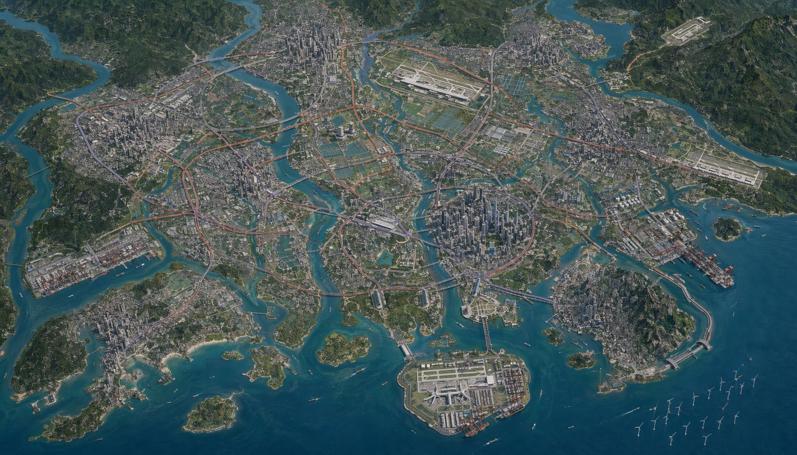
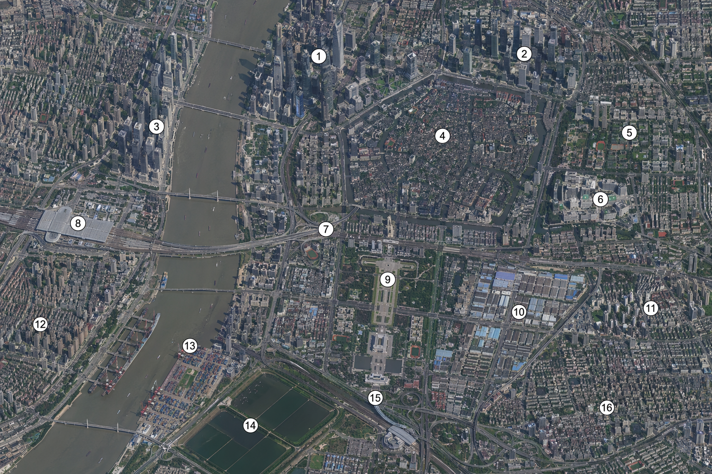
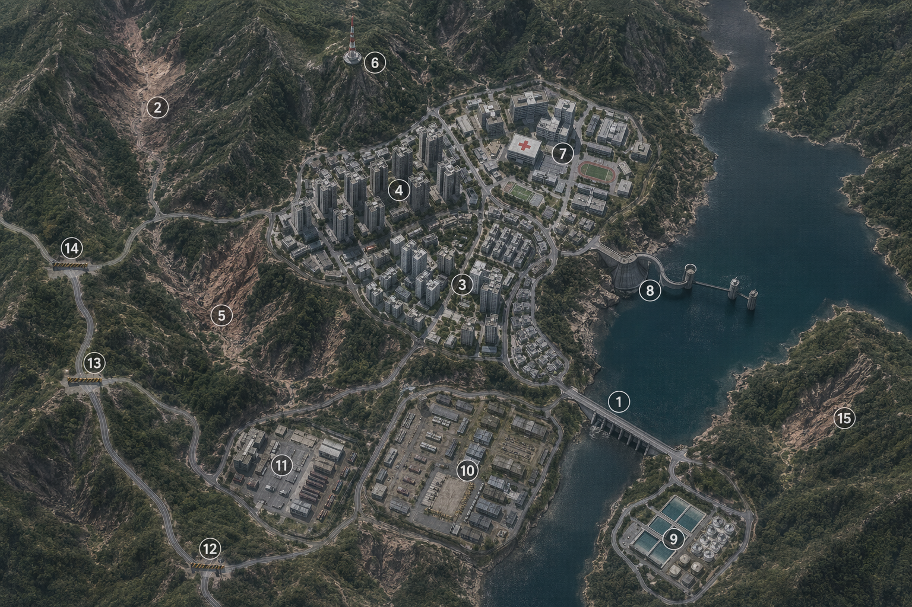
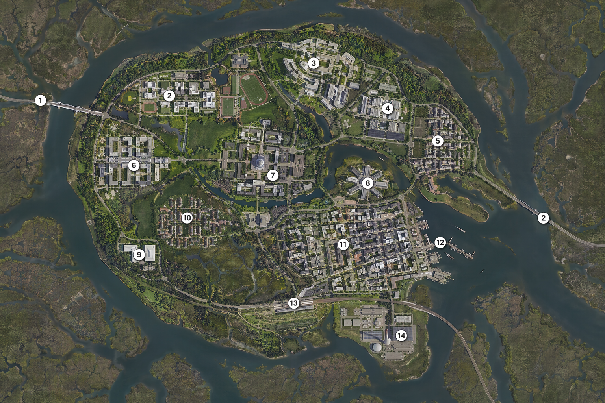
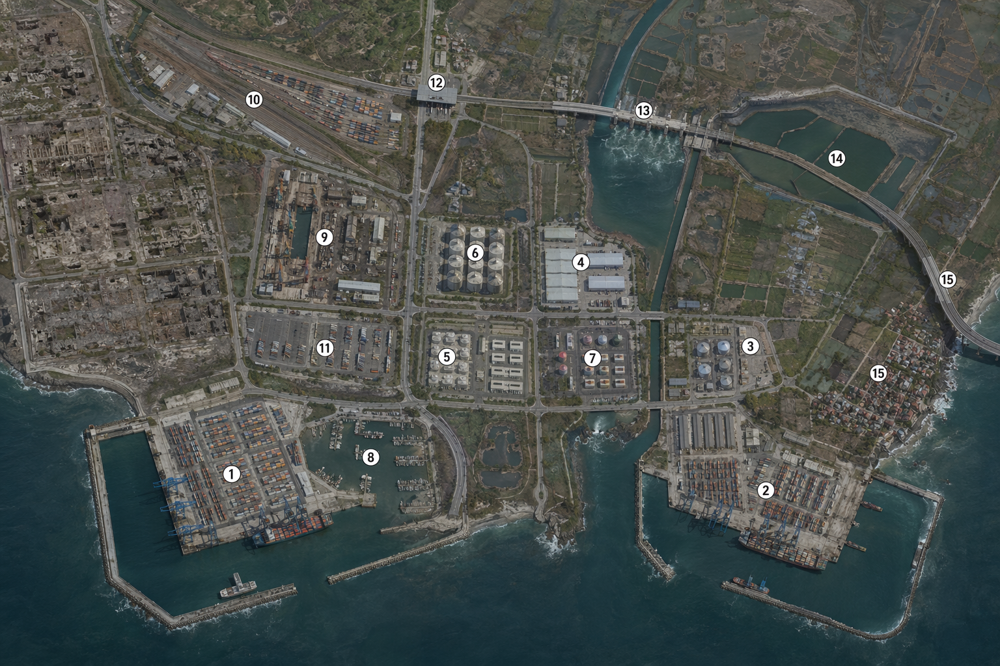
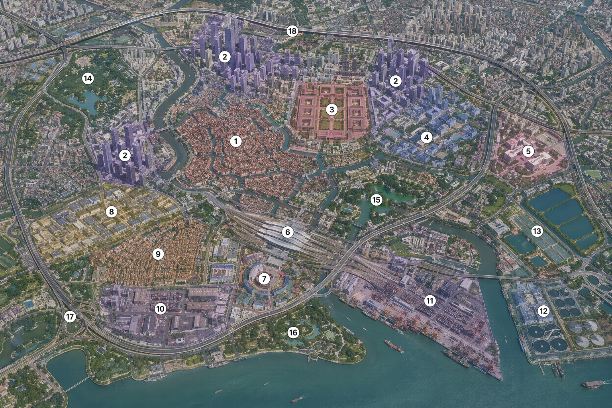
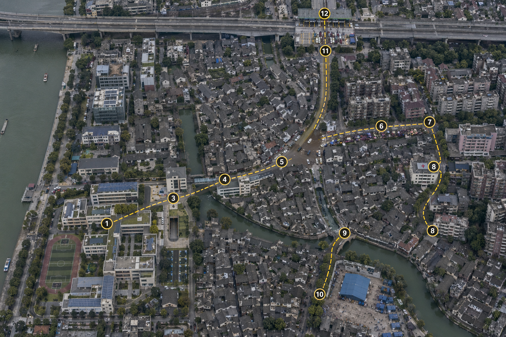
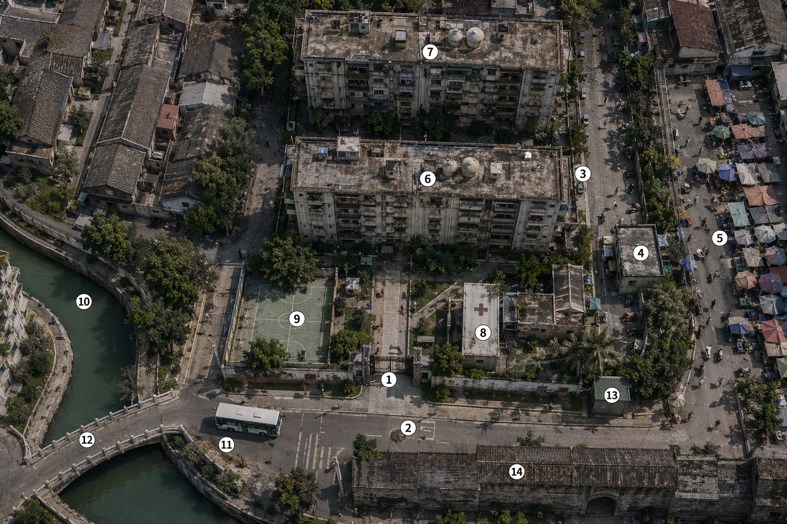

# 《赤潮北岸》地图集索引与功能说明

本地图集采用“图内只保留序号，文字信息只在本文件维护”的规则。所有地图均为虚构南江湾区，不对应现实行政区或真实设施。编号只在单张图内有效；写作引用应使用“图名 + 编号”，例如“主角起点小区图 08”。01 总览表现的是 **2080 年灾变前夕**已经成熟的多城市湾区，不是从零规划的一座超级城市。本文件与 `地图/提示词/00_湾区水文与交通连续性约束.md` 共同构成地理真源，时代上限以 [2080 年社会与技术基线](时代/2080年社会与技术基线.md) 为准，不再另维护重复的文字方向图。

超大都市修订提示词位于 `地图/提示词/`，供 Eikona 以 `--input` 直接加载；其中 `00_湾区水文与交通连续性约束.md` 是全图地理权威：上游宽阔潮汐主江、下游开放航道、港口转弯水域，以及“港口下游不紧接桥梁、跨湾优先海底隧道”的硬规则必须贯穿后续所有地图。

> **资产状态（待重生成）**：当前 01—08 PNG 只保留水系、城市位置、交通轴和编号拓扑的参考价值，不是已验收的 2080 年正式视觉设定。写作时以本文件、2080 年基线和提示词为准；图片不得反向决定建筑年代、能源设施或科技水平。验收门禁见 [01 湾区总览自审](地图/01_湾区总览_自审.md)。

## 2080 年视觉基线

- 城市必须显示 2020—2070 年代建成层的叠加：老城、城中村、中期高层、新 CBD、自动物流带和气候改造设施共存，不能画成风格统一的新城沙盘。
- 气候适应要可见：潮闸、泵隧、洪泛公园、湿地缓冲带、可淹首层、高架生命线、冷巷、遮阳顶和社区避难层与旧城肌理结合。
- 未来基础设施要可见但不喇宾夺主：先进裂变核电、海上风电、屋顶光储、长时储能、氢/氨工业储备、自动码头、无人电动路运、高精温室和生物安全设施。
- 不把霓虹、全城悬浮车、反重力建筑、巨型全息广告或完全无人的城市当作 2080 年快捷符号。

## 使用顺序

| 层级 | 地图 | 作用 | 适用剧情 |
| --- | --- | --- | --- |
| 区域 | [01 湾区总览](地图/01_湾区总览_编号图.png) | 城市群、资源与跨城通路 | 势力扩张、跨城任务、后期争霸 |
| 区域交通 | [01A 湾区综合交通](地图/01A_湾区综合交通_清洁图.png) | 高铁、城际、机场快线、港口货运和海底隧道 | 跨城时效、封锁、运输和战略机动 |
| 城市 | [02 南江主城](地图/02_南江主城_编号图.png) | 主城骨架 | 第一卷至中期日常、救援与旧案 |
| 城市 | [03 北岸高地](地图/03_北岸高地_编号图.png) | 水源与军管避难线 | 顾岚、训练、军管上位 |
| 城市 | [04 东湾学院城](地图/04_东湾学院城_编号图.png) | 知识与科研自治城 | 沈照雪、研究线、城际对立 |
| 城市 | [05 港区仓储低地](地图/05_港区仓储低地_编号图.png) | 粮药、冷链、账本与贸易 | 仓储联盟、资产侵占链、港口争夺 |
| 分区 | [06 南江职能分区](地图/06_南江职能分区_编号图.png) | 主城功能与风险分层 | 物资调度、路线选择、势力边界 |
| 街区 | [07 江湾至老城](地图/07_江湾至老城_编号图.png) | 第一卷撤离走廊 | 学校困楼、归家、第一次救援 |
| 小区 | [08 主角起点小区](地图/08_主角起点小区_编号图.png) | 叶知衡归家后的第一行动单元 | 家人、林栀、旧屋暗格、社区自救 |

## 01 湾区总览

| 编号 | 功能 | 稳定资源／限制 |
| --- | --- | --- |
| 1 | 南江北部主城 | 最大行政、历史与金融中心；多条上游河流在其南侧进入三角洲 |
| 2 | 西江制造城 | 老城、家电与机械制造带；依赖西部河运和铁路 |
| 3 | 东原工业城 | 制造、仓储与东部城际枢纽；连接东北山地腹地 |
| 4 | 东湾科技城 | 高密科技、金融和大学城区；灾后掌握数据与研发能力 |
| 5 | 外海港岛城 | 山地、国际港口与金融服务并存；陆路入口有限 |
| 6 | 中西河网制造城 | 河涌、城中村和产业镇密集；是连接北部主城与西部城市的中继 |
| 7 | 西南滨海双城 | 旅游、服务、轻工业和口岸经济；承担西部湾口通行 |
| 8 | 东北水库产业城 | 山地水库、电子制造与东部供水；灾后成为水源争夺点 |
| 9 | 北部国际机场 | 四跑道长途/应急航空枢纽，接入高铁、机场快线和自动货运廊道 |
| 10 | 湾心客货机场 | 填海岛上的客运、货运、无人机物流与恶劣天气备降中心；对风暴潮高度敏感 |
| 11 | 东部区域机场 | 服务东原工业城和东北产业城的双跑道机场 |
| 12 | 北岸应急机场 | 军管、救灾和物资投送使用的备用机场 |
| 13 | 先进裂变核电与智能电网中心 | 核电冷却、长时储能、变电、氢/氨调峰和维护隔离；不默认核聚变是主电源 |
| 14 | 西部深水港 | 面向西部出海口，拥有完整港池和转弯水域 |
| 15 | 东部深水港 | 面向东部出海口，与西港分担集装箱和粮药运输 |
| 16 | 外海风电场 | 季节性补电；台风维护窗口危险且不可替代 |
| 17 | 湾区高铁／城际主枢纽 | 三条高铁轴和内湾城际环的核心换乘点 |
| 18 | 粮食—温室—生物科技带 | 粮仓、高精温室、培养蛋白、种苗、营养液与生物安全研究设施 |

## 01A 湾区综合交通

01A 与 01 使用相同地貌和设施位置，但清洁版不重复绘制编号，避免复杂轨道背景导致序号复制或遗漏。阅读时以 01 的编号定位，再对照 01A 的交通线路。轨道颜色的文字释义只保留在本文件：红色实体双线为高铁，橙色为湾区城际，紫色为机场快线，深色轨道为港口货运铁路，蓝色虚线／门户为海底隧道。高速公路使用中性灰色，不能盖过铁路。

2080 年的无人电动路运、自动渡船、货运机器人和无人机只是轨道与水运的补充；它们受鉴权、能源、恶劣天气和净空限制，不得在地图上取代大容量轨道网。

- 高铁东西轴：2→6→1→3→8。
- 高铁南北轴：1→17→4→5，其中 4→5 使用铁路海底隧道。
- 沿海高铁轴：7→4→5。
- 城际内环：1→2→6→7→4→3→1，并向 8 放射。
- 机场快线：分别连接 9、10、11；12 只保留受控救灾支线。
- 港口货运铁路：14、15 分别接入内陆货场，并在 17 附近形成不进入客运核心的货运绕行线。

## 02 南江主城

1 西岸滨江 CBD；2 北岸金融商务核心；3 西岸高密度居住区；4 南江老城水网；5 东北大学与创新带；6 精准医疗、隔离与体育复合区；7 跨江铁路换乘点；8 高铁总站；9 旧行政与市民轴线；10 自动制造与微电网产业园；11 东南气候适应新城住区；12 西南高密度住区；13 内河自动货运港；14 滞洪、回用水与泵隧单元；15 南向城际与高速互通；16 外环大型居住新城。

主城的写作原则：学校、老城、医院和枢纽之间必须有明确的水位、步行时间、鉴权状态、阻断点与替代路线；任何人从 1 到 16，都不能因为有自动交通或 AI 导航，就在灾变第一夜“无代价直达”。
## 03 北岸高地

| 编号 | 功能 |
| --- | --- |
| 1 | 水库取水口 |
| 2 | 净水/回用水厂与微电网 |
| 3 | 山路检查站 |
| 4 | 旧营地训练区 |
| 5 | 军管指挥楼 |
| 6 | 精准医疗与应急医院 |
| 7 | 赤潮检测与生物安全楼 |
| 8 | 通信、光学中继与隔离算力节点 |
| 9 | 物资与长时储能仓 |
| 10 | 家属安置与气候避难区 |
| 11 | 高地温室与传统农场 |
| 12 | 山体塌方点 |
| 13 | 受保护旧隧道入口 |
| 14 | 外勤车队与自动车手动接管场 |
| 15 | 气象、水文与赤潮观测哨 |

北岸不是纯军事地图：1、2、6、10 共同构成“守住水与人”的合法性；4、5、7、14 才是顾岚与叶知衡的权力、训练和行动线。

## 04 东湾学院城

1 西侧桥/隧检查口；2 东侧桥/隧检查口；3 综合大学主校区；4 图书馆、纸本库与离线知识库；5 生物研究与模型校准楼；6 生物安全样本隔离楼；7 学生宿舍组团；8 精准医学中心；9 河岸湿地；10 小型研究港；11 城际站；12 微电网与隔离算力中心；13 市民混居区；14 岛缘堤坝与潮闸。

东湾的核心矛盾不是“科学家万能”，而是 4、5、6 所代表的知识与检测能力，必须依赖 1、2、8、12 所代表的秩序、医疗和能源才能落地。

## 05 港区仓储低地

1 自动深水集装箱港；2 散货与氢/氨能源码头；3 冷链仓；4 粮仓；5 药品与无菌耗材保税仓；6 氢/氨与危化缓冲区；7 自动货运铁路场；8 无人卡车待运/手动接管区；9 修船与维修机器人工场；10 渔港市场；11 防潮闸；12 排涝池与泵隧；13 高架撤离路；14 港区工人居住带；15 废弃厂区。

港区所有收益都要伴随成本：3 的冷链消耗电力，4 与 5 的库存必须有账本与守卫，6 不能成为随意爆炸的背景，11 与 12 决定风暴潮后是否还可以进入港区。

## 06 南江职能分区

| 编号 | 分区 | 写作任务 |
| --- | --- | --- |
| 1 | 老城水网核心 | 家庭、民生、内涝与小船路线 |
| 2 | 多中心 CBD 带 | 产业、商业、人群与高价值负荷 |
| 3 | 旧行政中心 | 档案、名册与旧关系 |
| 4 | 教育—科研带 | 设备、样本与专业人员 |
| 5 | 医疗隔离区 | 检测、病床与伦理压力 |
| 6 | 高铁总站 | 跨城信息、人流与停运 |
| 7 | 体育会展与换乘区 | 大空间避难、集结与疏散 |
| 8 | 科创制造园 | 备件、实验设备与产业工人 |
| 9 | 城中村住区 | 高人口密度、互助网络与消防隐患 |
| 10 | 内陆物流工业区 | 零件、油料与污染 |
| 11 | 港产作业区 | 工程机械、仓储与水路情报 |
| 12 | 水处理厂 | 清水、过滤与污水风险 |
| 13 | 滞洪池与农业接口 | 水位调节与温室物资入口 |
| 14 | 山地公园与水库 | 高处避难与观察点 |
| 15 | 湿地生态缓冲带 | 自然净化与菌雾边界 |
| 16 | 湾心公园岛 | 临时营地、公共空间与桥头控制 |
| 17 | 外环高速互通 | 进出北岸和卫星城的主动脉 |
| 18 | 北向高架走廊 | 跨区撤离、封控与救援线路 |

## 07 江湾至老城：第一卷撤离走廊

1 江湾学校主楼；2 校园连廊；3 校园外缘出口；4 内河步桥；5 老城入口路口；6 菜市西侧入口；7 菜市东侧入口；8 社区卫生室；9 内河桥；10 临时安置广场；11 北向检查口；12 高架接入口。

第一卷推荐走向为 1→3→4→5→6→8→9。2 可用于校园内的绕行与失散，7 是人群冲突和补给争夺点，10 只能提供短暂停留，11 与 12 则由水位、封控和北岸指令决定是否开放。

## 08 主角起点小区

主角起点暂定为南江老城与旧行政区交界的普通老旧小区；这是用户当前委托下的规划事实，可随主线调整。

| 编号 | 小区级节点 | 功能与限制 |
| --- | --- | --- |
| 1 | 小区主门 | 人群、登记与临时封锁；主角回家后的第一视觉锚点 |
| 2 | 公交站与掉头口 | 通往主城的旧秩序残影，也是车辆能否进入小区的判断点 |
| 3 | 林栀家所在楼 | 青梅重逢与邻里互助入口 |
| 4 | 社区便利店 | 少量密封食物、零钱账本与信息交换 |
| 5 | 菜市主入口 | 人流、鲜食与污染风险汇合点 |
| 6 | 主角家所在楼 | 家人线、旧屋与暗格；不可一开始就成为绝对安全屋 |
| 7 | 楼顶水箱 | 临时水源，但需说明净化、容量和占用规则 |
| 8 | 社区卫生室 | 伤口、发热筛查与药品冲突 |
| 9 | 小广场／球场 | 集结、配给、冲突调解与夜间照明问题 |
| 10 | 排水渠口 | 倒灌、异味与赤潮污染观察点 |
| 11 | 临时公交停靠点 | 外来消息、撤离谣言与人员转运点 |
| 12 | 内河桥 | 向老城外缘移动的桥头瓶颈 |
| 13 | 配电箱／变压器 | 断电、维修与触电风险 |
| 14 | 旧行政围墙侧门 | 进入档案线与北向路线的选择 |

## 连续性与扩展边界

- 图中只有序号；新增功能必须先写入本文件，再把对应地图作为空间参考，避免让图像中的偶然建筑反向决定剧情。
- 地图服务于“灾害、资源、路线、势力”四件事；不可把地图写成游戏任务面板。
- 每张图都必须同时有“旧城层”和“2080 年改造层”；不得把一个成熟湾区画成新建科幻主题公园。
- 每次救援或转移都必须明确起点、终点、可选路线、已切断路线、倒计时和失败代价。
- 每个区域都必须同时说明至少一项稀缺资源和对应的通行或控制成本。
- 核电、风电、粮食、港口、军管、科研均为长期阵营资源，不能在单章内无代价夺取或修复。
- 小区级地图只规定空间，不预设人物在任何时刻的位置；人物位置仍以章节时间线和知识边界为准。
- 全国／全球多点灾变已锁定为背景事实，但第一阶段地图仍只服务南江限知视角；后续扩图可从 2、3、7、8 号城市的陆路走廊、5 号港岛城与 14、15 号深水港的海外航线向外延伸。18 号仍固定为粮食—温室—生物科技带，不再误作卫星城群。
